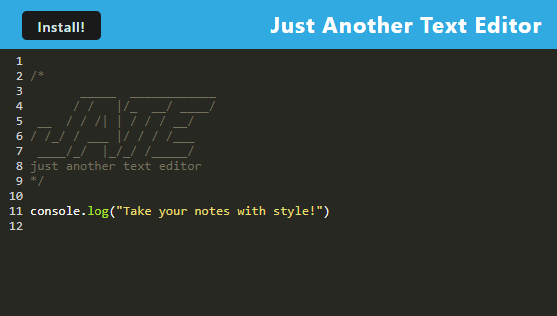

# Text Editor

## Description

This application gives a text editor experience that looks like a code editor. Take notes with computational style and thinking easily, and download those notes to local storage to keep those notes always available!

### Deployed Site Link

## Table of Contents

- [Installation](#installation)
- [Usage](#usage)
- [Credits](#credits)
- [License](#license)
- [Tests](#tests)
- [Questions](#questions)
- [Repository](#repository)

## Installation

Installation of this application uses the following steps:

<ul>
    <li>Step 1 - Clone the repository from GitHub</li>
    <li>In a terminal window, navigate to the directory meant for the storage of this code</li>
    <li>Type command $ git clone and paste the copied SSH key, then hit enter</li>
    <li>To install necessary packages: In the directory with this code, use the command $ npm i</li>
    <li>Starting Application: Run $ npm start</li>
    <li>Open your browser, go to localhost:3001</li>
</ul>
        
        
## Usage
 

## Credits

N/A

## License

MIT

## Tests

N/A

## Questions?

If any questions regarding this code, reach out to:
https://github.com/artiecannv

## Repository

https://github.com/artiecannv/text-editor
